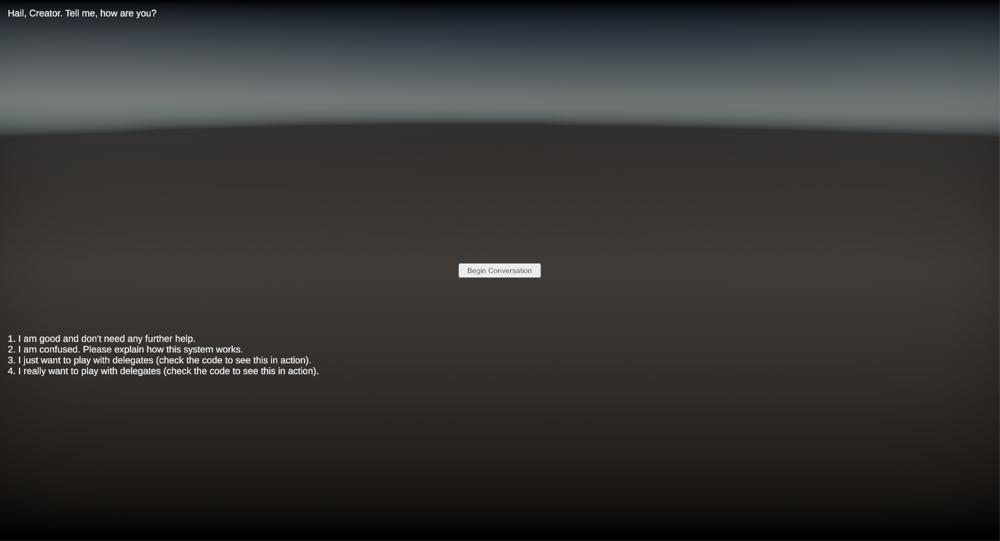
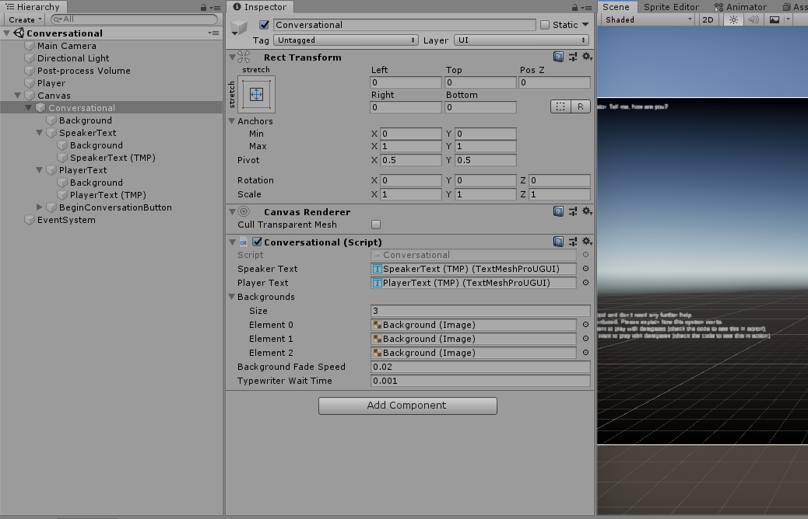
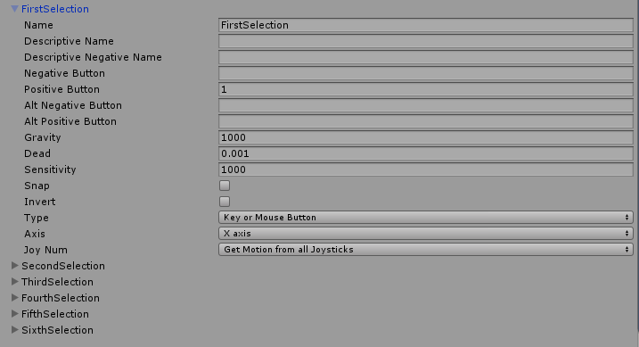

# Conversational
### A fast, easy conversation system with background fading and a typewriter effect

## Example
Conversations are created like this:
```cs
Conversation c = new Conversation();
c.Add("start", new List<ConversationEvent>() {
    new Say("Hail, Creator. Tell me, how are you?"),
    new Response("I am good and don't need any further help.", "end"),
    new Response("I am confused. Please explain how this system works.", "how_it_works"),
    new Response("I just want to play with delegates (check the code to see this in action).", "end", delegate {
        Debug.Log("Delegate called. Side effects here.");
    }),
    new Response("I really want to play with delegates (check the code to see this in action).", "end", OnSelect),
});
c.Add("how_it_works", new List<ConversationEvent>() {
    new Say("No problem. It's a simple system, defined in code. You start by adding the Conversational Prefab to your Canvas. " +
        "Next, call a series of functions to set up your conversation. You can see how this example works in the BeginConversationExample.cs"),
    new Response("Ok, thanks; I get it.", "end"),
    new Response("What if I want to customize how the UI looks?", "how_it_looks"),
});
c.Add("how_it_looks", new List<ConversationEvent>() {
    new Say("You can change how the Background, SpeakerText, and PlayerText children of the Conversational prefab look using the standard Unity UI tools."),
    new Response("Thanks!", "end"),
});
conversational.BeginConversation(c);
```

and look like this:



## Setup
1. Copy the files `Conversational.cs` and `BeginConversationExample.cs` (if using) to your Unity project.

2. Setup your Canvas tree like so:

Where "Conversational" is a panel which contains two empties, SpeakerText and PlayerText, which each contain a TextMeshPro Text and a background image. Conversational also contains a global background.
(don't forget to add the Conversational script to the Conversational Panel and wire those in and the BeginConversationExample to a button)

3. Add the buttons to select the options to your Edit > Project Settings > Input menu:


4. Run
